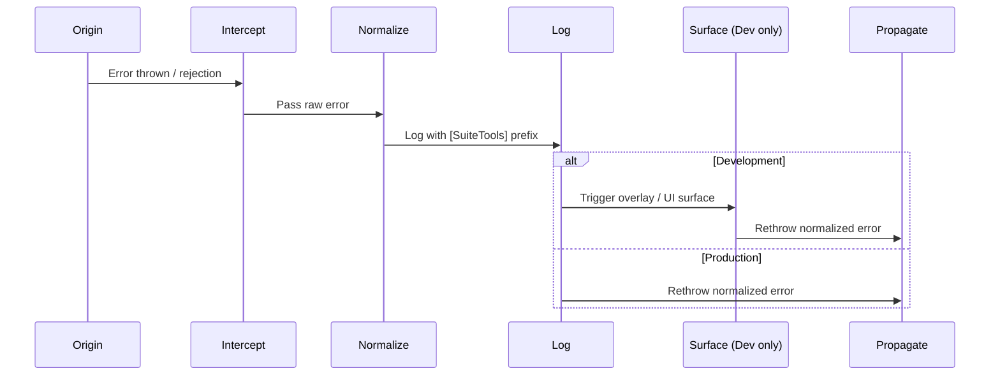

# Error Handling

_A Unified Lifecycle for Predictable, Discoverable, and Safe Error Management_

_Last updated: September 1, 2025_

<!-- License badges: keep in sync with LICENSE, LICENSE-DOCS.md and ATTRIBUTION.md -->
[](../../LICENSE-DOCS.md) [](../../LICENSE)
[](../../ATTRIBUTION.md) [](https://github.com/mattplant/SuiteTools/)

<!-- TODO: split the doc into multiple pages -->

SuiteTools uses a **single, predictable pattern** for catching, normalizing, and reporting errors across the suite for **robust error management** and **clear, user‑friendly feedback**.

Our approach is **predictable**, **discoverable**, and **consistent**. It ensures that:

- **Users get better experiences** — actionable, safe messages instead of cryptic failures.
- **Unclear or unhandled error states are eliminated** — every error is surfaced, normalized, and addressed.
- **Error logic stays cleanly separated from feature code** — keeping business logic focused, testable, and easier to maintain.

By standardizing how errors are thrown, caught, displayed, and reported, we prevent silent failures, make debugging predictable, and give develpers a shared language for diagnosing and resolving problems wherever they originate.

---

## Problem This Solves

Without a unified approach, errors are handled inconsistently — logs vary, normalization is ad‑hoc, and some errors vanish entirely. This leads to:

- Silent failures that are hard to detect.
- Inconsistent logs that slow down debugging.
- Confusion for new developers who must reverse‑engineer multiple patterns.
- Mixing error handling with business logic makes both harder to maintain.

A single, predictable lifecycle solves these issues by giving every developer the same mental model and enforcing **separation of concerns** — keeping error handling logic out of feature code for cleaner, more maintainable systems.

---

## Why Standardize

Without a standard, developers guess where to log, how to normalize, and when to rethrow — leading to drift, silent failures, wasted debugging time, and error handling tangled with business logic. **Standardization ensures every workspace surfaces and propagates errors in the same way, so debugging is predictable and UX is consistent across the suite.**

> **Rule of thumb:** *Every error is normalized, logged, and rethrown — in that order — regardless of origin.*

---

## Purpose

Define a single, predictable lifecycle for handling errors across the SPA and backend contexts. This gives developers one mental model for error handling, reduces cognitive load, and enables automated tooling (lint rules, test harnesses) to enforce compliance.

---

## Why This Matters

A unified lifecycle means:

- **Better UX** — users always know what went wrong and what to do next.
- **No hidden failures** — every error path is predictable and visible to both developers and tooling.
- **Faster onboarding** — new developers can debug on day one without reverse‑engineering flows.
- **Cleaner separation of concerns** — error handling stays out of business logic, making both easier to maintain.

This consistency is part of SuiteTools’ commitment to being a reference‑quality monorepo — predictable, discoverable, and safe to extend.

---

## Development vs Production Behavior

In development, errors are surfaced loudly; in production, they’re logged and rethrown silently.

| Environment      | Behavior                                                                                                     |
|------------------|--------------------------------------------------------------------------------------------------------------|
| **Development**  | **Origin → Intercept → Normalize → Log → Surface (Dev) → Propagate** – Full lifecycle with overlays/UI noise |
| **Production**   | **Origin → Intercept → Normalize → Log → Propagate** – Full lifecycle without UI noise                       |

---

## Error Handling Lifecycle

In SuiteTools, an error begins at its **origin point**, is **caught**, optionally **surfaced to developers** through overlays or adapter‑driven UI, and finally **reported upstream** for logging, monitoring, and triage.

> **Core Principle:** Always pass errors through `handleError()` at the highest catch point.
> This ensures normalization, consistent logging, and predictable dev/prod behavior.

`handleError()` is the single, predictable gateway for all error normalization, logging, and optional surfacing. Every error — regardless of origin — passes through the same sequence:

1. **Origin** – Error occurs in app code, a dependency, or a global event like `window.onerror`.
2. **Intercept** – Outermost `catch` block or global hook captures it.
3. **Normalize** – Convert any thrown value to a `NormalizedError`.
4. **Log** – Emit with `[SuiteTools]` prefix for grep‑friendly output.
5. **Surface (Dev)** – Optionally trigger overlays/UI for developer visibility.
6. **Propagate** – Rethrow for upstream handling, monitoring, and triage.



---

## Error Entry Points

These are the first places an error becomes catchable. Wire them directly to `handleError()` to ensure normalization, consistent logging, and predictable behavior.

```text
┌───────────────────────────────────────────────────────────────────────────────────────┐
│                                     SPA (Browser)                                     │
├───────────────────────────────────────────────────────────────────────────────────────┤
│ 1. Async/await in app code       ──► try/catch → handleError()                        │
│ 2. Promise rejections            ──► .catch(handleError)                              │
│ 3. React error boundaries        ──► componentDidCatch → handleError()                │
│ 4. Global async errors           ──► window.onunhandledrejection → handleError()      │
│ 5. Global sync errors            ──► window.onerror → handleError()                   │
│ 6. Event listener bodies         ──► try/catch inside listener → handleError()        │
└───────────────────────────────────────────────────────────────────────────────────────┘

┌───────────────────────────────────────────────────────────────────────────────────────┐
│                                     Backend (API)                                     │
├───────────────────────────────────────────────────────────────────────────────────────┤
│ 7. Route handlers / controllers  ──► try/catch → handleError()                        │
│ 8. Middleware error handlers     ──► central error middleware → handleError()         │
│ 9. Background workers            ──► wrap worker fn in try/catch → handleError()      │
└───────────────────────────────────────────────────────────────────────────────────────┘
```

---

## Guidelines

1. **Use outermost catch** – Call `handleError()` at the highest catch in a flow.
2. **Wire global hooks** – Pass raw errors/reasons from:
   - `window.onerror`
   - `window.onunhandledrejection`
   - `process.on("uncaughtException")`
   - `process.on("unhandledRejection")`
   directly to `handleError()`.
3. **Avoid double‑handling** – After an error goes through `handleError()`, let it bubble unless you have a specific recovery path.
4. **Dev vs. prod behavior** – In development, expect overlays; in production, prefer logging and rethrow without UI noise.

---

## Error Taxonomy

A unified lifecycle works best when every error has a clear, consistent type. In SuiteTools, errors are **first‑class citizens** of the architecture.

A clear taxonomy makes failures **predictable**, **consistent**, and **safe** to handle across all layers.

We define errors explicitly so they are:

- **Predictable** — categories are known at each boundary.
- **Consistent** — stable codes/namespaces enable automated logging, telemetry, and UI handling.
- **Safe** — no sensitive data leaks into logs or client‑facing messages.
- **Discoverable** — developers can quickly locate or extend the right type.
- **Actionable** — structured metadata supports debugging, reproduction, and resolution.

By treating errors as part of the system’s **contract** — not just exceptions — we make SuiteTools more robust, maintainable, and developer‑friendly.

### Base Class

All thrown errors **must** extend from **`SuiteError`** to ensure a consistent shape and predictable handling.

### Common Subclasses

- **`SchemaValidationError`** — Data shape or type is invalid.
  Common at transport/domain boundaries or when mapping between layers.
  Examples: missing required fields, invalid date formats, mismatched enum values.

- **`NetSuiteApiError`** — Communication with the NetSuite API failed.
  Includes request‑side issues (timeouts, bad payloads) and response‑side errors (unexpected status codes, malformed data).

**Planned:**

- **`ConfigError`** — Required configuration is missing or invalid.
  Often caught at startup to prevent runtime failures.
  Examples: missing environment variables, unsupported feature flags.

- **`UIRenderError`** — Unexpected rendering failure in the frontend.
  Typically caused by missing props, incompatible view models, or unhandled state.

### When to Create a New Subclass

Create a new subclass when:

- The error needs **special handling or display**.
- It is **domain‑specific and likely to recur**.
- You want to **group related failures under a clear namespace** for easier filtering in logs/telemetry.
- It benefits from **structured metadata** that should always be present for that category.

---

## Throwing Errors

Throwing errors in a **consistent, predictable way** makes them easier to catch, display, and report.
Every thrown error in SuiteTools should be **typed**, **contextual**, and **routed** so that downstream handlers — whether in a React boundary, async flow, or global listener — can respond appropriately.

SuiteTools uses a hierarchy of `SuiteError` subclasses to ensure that every thrown error:

- **Carries clear intent** — The class name signals the domain and failure type.
- **Preserves context** — Original stack traces and metadata are never lost.
- **Supports targeted handling** — Downstream code can branch on error type without brittle string matching.

By following these guidelines, we:

- Keep error types explicit and discoverable.
- Preserve valuable debugging context.
- Prevent silent failures and hard‑to‑trace bugs.
- Stop invalid data early before it causes cascading issues.

### Guidelines

- **Prefer `SuiteError` subclasses**
  Use domain‑specific error classes (e.g., `SchemaValidationError`, `NetSuiteApiError`) to make intent clear and enable targeted handling.

- **Preserve original context**
  When wrapping an error, include the original error object or its key properties so stack traces and metadata aren’t lost.

- **Avoid silent failures**
  Never catch and ignore errors without logging or rethrowing; this hides problems and complicates debugging.

- **Throw early in validation**
  Fail fast when data is invalid to prevent downstream logic from running on bad input.

> 💡 **Tip:** If you’re unsure which subclass to throw, start with `SuiteError` and refine later.
> Always route thrown errors into `handleError()` so they follow the same normalization and reporting path as caught errors.

---

## Error Boundaries & Catching

Catching errors at the **right layer** is as important as throwing them consistently.
Every boundary or listener described here should route captured errors into `handleError()` to ensure **normalization**, **consistent logging**, and **predictable dev/prod behavior**.

By standardizing where and how errors are caught, we:

- **Prevent silent failures** — no error disappears without being logged or surfaced.
- **Keep error handling logic discoverable and reusable** — developers know exactly where to look and how to extend.
- **Maintain separation from business logic** — keeping feature code focused and testable.
- **Ensure environment‑appropriate detail** — verbose overlays in development, safe messages in production.

### UI Layer *(Planned)*

- **`AppErrorBoundary`** — Top‑level React error boundary that catches render‑time errors in its child tree and displays a safe fallback UI.
- **`useErrorBoundaryTrigger`** — Hook for escalating async errors into the nearest error boundary, ensuring they’re handled consistently with render‑time failures.

### Async Flows

- **`handleError`** — Utility that centralizes `try/catch` logic for async operations, applying consistent logging, reporting, and escalation patterns.

### Routing

- **`useRouteError`** — React Router hook for accessing loader/action errors in route components.
- **`ErrorPage`** — Route‑level fallback UI for displaying safe, user‑friendly error messages when navigation or data loading fails.

### Global Listeners *(Planned)*

- **`window.onerror`** — Captures uncaught synchronous errors at the global level.
- **`unhandledrejection`** — Captures unhandled Promise rejections, surfacing async failures that escape local handling.

---

## Displaying Errors

Once an error is caught, **how it’s displayed depends on the environment**:

- **Development** — Expose as much context as possible to speed up debugging.
- **Production** — Protect users from technical details while still providing a clear, trustworthy experience.

By separating display logic for each environment, we:

- **Keep developer feedback loops fast and informative** — rich context in dev accelerates diagnosis.
- **Prevent sensitive or internal details from leaking** — production messages are scrubbed for safety.
- **Maintain a consistent, predictable UI for error states** — users and developers know what to expect.

> **Note:** All display components should receive normalized error objects from `handleError()` so they can render consistently regardless of where the error originated.

### Development

- **`DevSuiteErrorOverlay`**
  A rich, in‑browser overlay that surfaces stack traces, schema details, and contextual metadata to help developers quickly identify and resolve issues.

### Production

- **`DefaultFallback`**
  A safe, user‑friendly fallback UI that communicates failure without exposing implementation details.

- **No sensitive data**
  All production error messages are scrubbed of stack traces, schema internals, or any information that could compromise security or user trust.

---

## Reporting & Telemetry *(Planned)*

Catching an error is only half the job — **reporting it ensures we can diagnose, track, and improve over time**.

SuiteTools will use a **single, centralized reporting utility** to keep error data consistent across environments and make future integrations with monitoring services (e.g., Sentry, Datadog, custom dashboards) straightforward.

By standardizing reporting, we:

- **Avoid fragmented or duplicate logging logic** — one path for all error reporting.
- **Ensure consistent metadata** — every error carries the same core fields for debugging and analysis.
- **Keep development feedback loops fast** — rich local reporting now, production‑grade monitoring later.
- **Prepare for seamless integrations** — external services can be added without changing developer workflows.

---

### Planned Utility

- **`reportError`**
  A single entry point for sending normalized error data (from `handleError()`) to:
  - Local dev console overlays.
  - In‑memory logs for hot‑reload debugging.
  - External monitoring services in production.

---

### Reporting Flow

```text
Throw → Catch → handleError()
       → reportError()
           ├─ Dev: console + overlay
           └─ Prod: monitoring service
```

---

## Integration Patterns

Error handling in SuiteTools isn’t an afterthought — it’s **baked into component, hook, and routing patterns** so developers don’t have to reinvent the wheel.

Following these integration patterns ensures that errors are:

- Caught at the right layer.
- Escalated when needed.
- Displayed in a consistent, predictable way.

By applying these patterns, we:

- Keep error handling logic discoverable and reusable.
- Ensure async failures surface in the same way as render‑time errors.
- Maintain a clear separation between catching, displaying, and reporting.

### Components & Hooks

- **Use `handleError`**
  Wrap async logic in a consistent `try/catch` pattern that applies centralized logging, normalization, and escalation.
  This ensures all errors — whether from network calls, schema validation, or internal logic — follow the same reporting and display rules.

### Async Escalation

- **Pass `reactTrigger`** from `useErrorBoundaryTrigger`
  Escalate async errors into the nearest React error boundary so they’re handled exactly like render‑time failures.
  This keeps UI error states consistent and avoids “invisible” async failures.

### Routing

- **Route loader/action errors → `ErrorPage`**
  Ensure navigation and data‑loading failures are surfaced with a safe, user‑friendly fallback UI, rather than leaving the user in a broken or partially loaded state.

### Pattern Map

```text
Component / Hook
   │
   ├─ try/catch → handleError()
   │
   └─ (optional) reactTrigger(error)
           │
           ▼
     AppErrorBoundary → Display → Report
```

> **developer Tip:**
> When adding new components or hooks that perform async work, always decide:
>
> 1. **Should this error be handled locally** with `handleError()`?
>    Use this when the component can gracefully recover or when you want to log/report without interrupting the UI flow.
>
> 2. **Should it escalate to a boundary** via `reactTrigger(error)`?
>    Use this when the failure should trigger a full UI fallback, matching the behavior of render‑time errors.
>
> Making this decision early keeps error handling predictable, avoids “hidden” async failures, and ensures developers know exactly where to look when debugging.

## Advanced Patterns

For complex scenarios, SuiteTools provides patterns that go beyond the basics.
These are designed for developers working on **cross‑workspace features**, **schema‑driven UIs**, or **shared infrastructure** where error handling must remain predictable and maintainable at scale.

By applying these advanced patterns, we:

- Keep error handling consistent across workspaces and packages.
- Avoid duplication of mapping, formatting, and escalation logic.
- Ensure developers can extend error handling without breaking existing flows.

### 1. Cross‑Workspace Error Propagation

When an error originates in one workspace but must be handled in another:

- **Normalize before crossing boundaries**
  Always pass a `SuiteError` (or subclass) across workspace boundaries — never raw `Error` objects.
  This ensures downstream code can rely on consistent shape and metadata.

- **Use shared error factories**
  Define reusable creators in a shared `errors/` package so all workspaces throw the same class for the same failure type.

### 2. Schema‑Driven Error Mapping

For validation‑heavy flows (e.g., form builders, API adapters):

- **Map schema failures to typed errors**
  Convert Zod or other schema validation results into `SchemaValidationError` with a structured `issues` array.

- **Preserve field‑level context**
  Include the path, expected type, and received value in the error metadata so UI components can highlight the exact field in error states.

### 3. Error Adapters

When integrating with third‑party APIs or libraries:

- **Wrap external errors**
  Use an adapter function to translate unknown error shapes into a `SuiteError` subclass with normalized metadata.

- **Preserve original error**
  Store the raw error object in a `cause` property for debugging, but never expose it directly in production UIs.

### 4. Layer‑Aware Escalation

For complex async flows:

- **Escalate intentionally**
  Decide whether to:
  - Handle locally with `handleError()` (recoverable errors).
  - Escalate to a React boundary via `reactTrigger()` (UI‑blocking errors).
  - Surface at the route level via `ErrorPage` (navigation/data‑loading errors).

---

### Advanced Pattern Map

```text
[ Workspace A ]
   throw SuiteError
        │
        ▼
normalizeError() ──→ cross boundary ──→ [ Workspace B ]
                                             │
                                             ▼
                                      handleError()
                                             │
                                             ├─ Display (Dev/Prod)
                                             └─ reportError()
```

---

## Cheat Sheet

Error handling in SuiteTools is **pattern-driven** — developers don’t need to guess where to catch, escalate, or display errors. Use this guide to plug into the system with confidence.

### Pattern Matrix

| Context                   | Use This Pattern                          | Escalates To               | Display Surface       |
|---------------------------|-------------------------------------------|----------------------------|-----------------------|
| Component async logic     | `handleError` + optional `reactTrigger`   | Nearest error boundary     | Inline or fallback UI |
| Hook logic                | `handleError` + `useErrorBoundaryTrigger` | React error boundary       | Boundary fallback     |
| Route loader/action       | Throw error → handled by router           | React Router boundary      | `ErrorPage`           |
| Background task / utility | `handleError` only                        | Logging + optional rethrow | No direct display     |

> ℹ️ Background tasks (e.g. analytics, cache refresh, silent sync) should log via `handleError` but typically don’t escalate to UI. Use rethrow only if failure affects user flow.

---

### Common Pitfalls

Avoid these anti-patterns to keep error handling predictable and contributor-friendly:

- ❌ Swallowing errors silently (`catch` without `handleError`)
- ❌ Using `console.error` instead of centralized logging
- ❌ Forgetting to pass `reactTrigger` for async escalation
- ❌ Mixing display logic with error-catching logic
- ❌ Escalating background task errors unnecessarily

---

### Contributor Tips

- **Normalize early**: Use `handleError` to apply consistent formatting, metadata, and logging.
- **Escalate intentionally**: Async errors should behave like render-time failures when user-facing.
- **Display separately**: Keep UI fallback logic out of error-catching layers for clarity and reuse.
- **Use boundaries wisely**: Don’t over-escalate — only escalate when the error affects user experience.
- **Document edge cases**: If your logic handles unusual failure modes, leave a comment or link to the lifecycle guide.

---

## Examples

These examples show how to apply SuiteTools’ error‑handling patterns in real code.
They’re intentionally minimal so developers can see the **core usage** without unrelated boilerplate.

### Throwing a Schema Validation Error

Use a domain‑specific error class to make the failure type explicit and ensure it’s caught and reported with the right metadata.

```ts
if (!schema.safeParse(data).success) {
  throw new SchemaValidationError('Invalid user payload', { data });
}
```

**Why this works:**

- Fails fast during validation.
- Uses a typeded error (`SchemaValidationError`) for targeted handling
- Preserves the invalid payload for debugging and reporting.

### Escalating an Async Error to a Boundary

When an async operation fails inside a component or hook, escalate it to the nearest React error boundary so it’s handled consistently with render‑time errors.

```ts
const triggerErrorBoundary = useErrorBoundaryTrigger();

try {
  await fetchData();
} catch (err) {
  triggerErrorBoundary(err);
}
```

**Why this works:**

- Keeps async and render‑time error handling consistent.
- Avoids "invisible" async failures that never surface in the UI.
- Ensures the error flows through `handleError()` --> display --> report.
