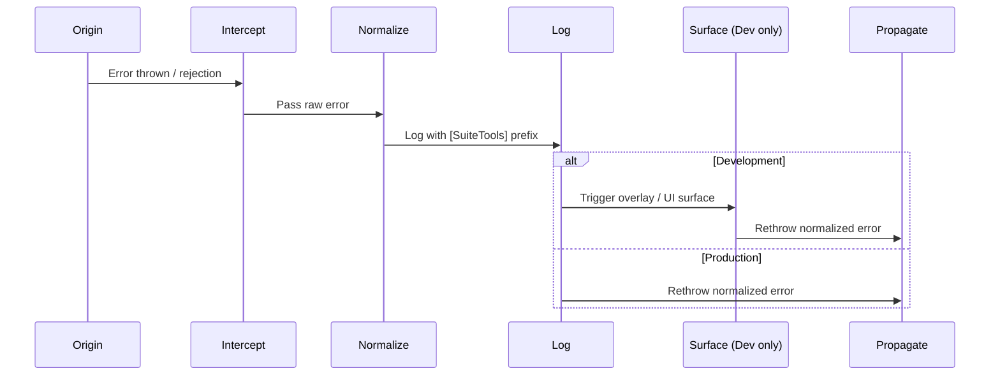

# 📜 Error Handling Standards

> Part of the SuiteTools governance set.
> See [/docs/governance](../README.md) for related policies and resources.

Last updated: September 22, 2025

---

## 🎯 Purpose & Scope

Defines the **binding rules and taxonomy** for error handling in SuiteTools.
This document is authoritative and enforceable — all contributors must follow these standards.

It covers:

- Canonical error lifecycle
- SuiteTools error taxonomy
- Rules for throwing, catching, and propagating errors
- Required metadata and enforcement boundaries

These standards are designed to be enforceable by automated tooling such as lint rules and test harnesses, ensuring compliance can be validated automatically.

> 📐 **Looking for the big picture?**
> This document defines binding rules.
> For narrative context and design philosophy, see [📐 Error Handling Architecture](../../architecture/error-handling-architecture.md).

---

## 🔄 Error Lifecycle (Canonical)

All errors in SuiteTools must follow this lifecycle:

1. **Origin** — errors are thrown only at defined boundaries.
2. **Intercept** — errors are caught and normalized into a `SuiteError`.
3. **Normalize** — errors are enriched with metadata (code, context, severity).
4. **Log** — errors are recorded locally or sent to telemetry.
5. **Surface** — errors are displayed consistently (dev overlays, prod fallbacks).
6. **Propagate** — errors are rethrown or escalated if not fully handled.

<!-- TODO: reconcile above with this.
1. **Origin** – Error occurs in app code, a dependency, or a global event like `window.onerror`.
2. **Intercept** – Outermost `catch` block or global hook captures it.
3. **Normalize** – Convert any thrown value to a `NormalizedError`.
4. **Log** – Emit with `[SuiteTools]` prefix for grep‑friendly output.
5. **Surface (Dev)** – Optionally trigger overlays/UI for developer visibility.
6. **Propagate** – Rethrow for upstream handling, monitoring, and triage. -->

---

## 🌐 Development vs Production Behavior (Governance)

Error handling behavior differs by environment. These rules are **binding** and must be followed in all SuiteTools workspaces.

| Environment     | Required Behavior |
|-----------------|-------------------|
| **Development** | **Origin → Intercept → Normalize → Log → Surface (Dev) → Propagate** – Errors **must** surface visibly (e.g., overlays, console) for fast debugging. |
| **Production**  | **Origin → Intercept → Normalize → Log → Propagate** – Errors **must not** surface raw details to end‑users. They **must** be logged and rethrown silently, with only safe fallback UI shown. |

### 📏 Enforcement Rules

- All errors **must** pass through `handleError()` at the highest catch point.
- In **development**, `handleError()` **must** trigger developer overlays or equivalent surfacing.
- In **production**, `handleError()` **must** log and rethrow errors without exposing sensitive details.
- Fallback UIs in production **must** be neutral and user‑safe.

### 📏 Core Principle (Enforceable)

- All errors **must** pass through `handleError()` at the highest catch point.
- This ensures normalization, consistent logging, and predictable dev/prod behavior.
- `handleError()` is the authoritative gateway for error handling in SuiteTools — no alternative pathways are permitted.

---

## 📑 Required Metadata

Every `SuiteError` **must** include:

- `code` — unique, stable identifier (used in logs, telemetry, dashboards)
- `message` — developer‑facing, actionable description
- `context` — structured metadata (object with reproducible details)
- `severity` — one of: `info`, `warning`, `error`, `fatal`
<!-- TODO: check this metadata. Severity list does not match NetSuite. -->

## 🗂️ Error Taxonomy

A unified lifecycle works best when every error has a clear, consistent type. In SuiteTools, errors are **first‑class citizens** of the architecture.

A clear taxonomy makes failures **predictable**, **consistent**, and **safe** to handle across all layers.

We define errors explicitly so they are:

- **Predictable** — categories are known at each boundary.
- **Consistent** — stable codes/namespaces enable automated logging, telemetry, and UI handling.
- **Safe** — no sensitive data leaks into logs or client‑facing messages.
- **Discoverable** — developers can quickly locate or extend the right type.
- **Actionable** — structured metadata supports debugging, reproduction, and resolution.

By treating errors as part of the system’s **contract** — not just exceptions — we make SuiteTools more robust, maintainable, and developer‑friendly.

### Base Class

All thrown errors **must** extend from **`SuiteError`** to ensure a consistent shape and predictable handling.

- **Base class:** `SuiteError`

### Canonical Subclasses

- **`SchemaValidationError`** — Data shape or type is invalid.
  Common at transport/domain boundaries or when mapping between layers.
  Examples: missing required fields, invalid date formats, mismatched enum values.

- **`NetSuiteApiError`** — Communication with the NetSuite API failed.
  Includes request‑side issues (timeouts, bad payloads) and response‑side errors (unexpected status codes, malformed data).

### Proposed / Planned Subclasses

Not yet implemented, subject to governance review.

- **`ConfigError`** — Required configuration is missing or invalid.
  Often caught at startup to prevent runtime failures.
  Examples: missing environment variables, unsupported feature flags.

- **`UIRenderError`** — Unexpected rendering failure in the frontend.
  Typically caused by missing props, incompatible view models, or unhandled state.

<!-- TODO: Do we also need an `UnexpectedError`?
- **`UnexpectedError`** — Catch‑all for unclassified or unknown failures.
  Used sparingly; most errors should map to a specific subclass.
  Helps ensure no error goes unhandled. -->

### When to Create a New Subclass

Create a new subclass when:

- The error needs **special handling or display**.
- It is **domain‑specific and likely to recur**.
- You want to **group related failures under a clear namespace** for easier filtering in logs/telemetry.
- It benefits from **structured metadata** that should always be present for that category.

- **Rules for new types:**
  - Must extend `SuiteError`
  - Must define a unique `code`
  - Must be documented in taxonomy reference

---

## 📏 Governance Rules

- Errors **MUST NOT** be thrown from deep inside core logic — only at boundaries.
- Errors **MUST** be normalized into a `SuiteError` before crossing workspace boundaries.
- Errors **MUST** include required metadata.
- Errors **MUST NOT** be silently swallowed — they must be logged or surfaced.
- Errors **MUST** propagate predictably unless explicitly handled.

---

## 🧭 Stewardship Callout

- This document is a governance artifact — changes require review and changelog entry.
- Keep taxonomy definitions in sync with implementation.
- Cross‑link this doc from onboarding and contributor guides.
